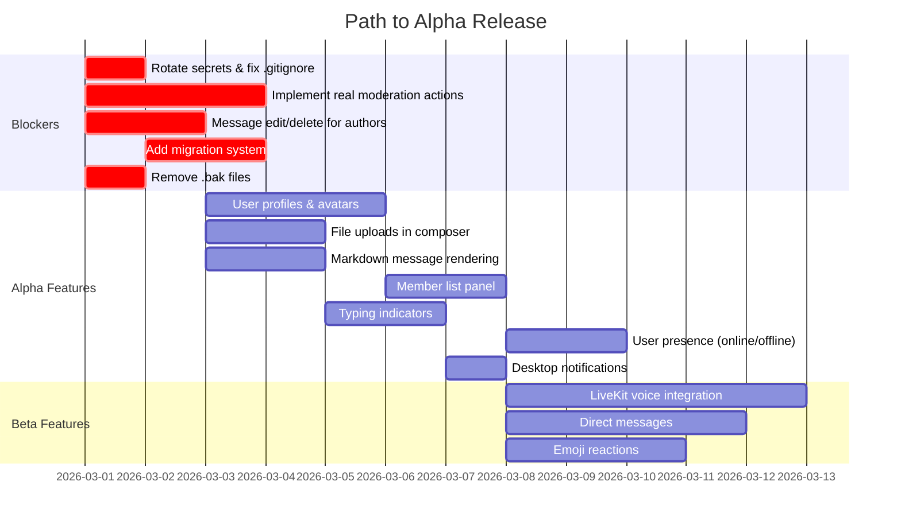

# EscapeHatch — Release Readiness Report

**Date:** 2026-02-28  
**Scope:** Top-to-bottom codebase analysis comparing current state against Discord's core feature set and identifying everything needed for an initial release.

---

## Executive Summary

EscapeHatch is a Matrix-backed, Discord-like community platform with a custom control plane (Fastify/TypeScript), Next.js web client, and PostgreSQL persistence. The project has a solid foundation covering **auth, provisioning, text chat, channel/category management, moderation, delegation, federation policy, Discord bridging, and voice presence scaffolding**. However, several critical features are either **incomplete** or **entirely absent** compared to even Discord's most basic UX. This report breaks down what's broken/incomplete, what's missing vs. Discord, and what's needed for initial release.

---

## 1. Broken or Incomplete Items Found in Code

### 🔴 Critical

| Item | Location | Issue |
|------|----------|-------|
| **Voice/Video has no actual SFU integration** | [voice-service.ts](file:///home/lupi/Documents/EscapeHatch/EscapeHatch/apps/control-plane/src/services/voice-service.ts) | Issues a custom JWT token but **never connects to LiveKit**. The LiveKit container runs in Docker Compose but nothing calls its SDK. Voice presence (join/leave/mute state) is tracked in DB, but no actual audio/video is transmitted. |
| **Moderation actions are audit-only** | [moderation-service.ts](file:///home/lupi/Documents/EscapeHatch/EscapeHatch/apps/control-plane/src/services/moderation-service.ts#L80-L101) | `performModerationAction` writes to the audit log but **`run()` is a no-op stub** — kick/ban/timeout/redact don't actually remove users or delete messages. Channel controls (lock/slow mode) *do* persist to DB. |
| **Secrets committed to `.env`** | [.env](file:///home/lupi/Documents/EscapeHatch/EscapeHatch/.env) | Discord OAuth client secret, bot token, DB password, Synapse access token, and session secret are all committed. These **must** be rotated and the file `.gitignore`'d before any public release. |
| **Backup files in production source** | `components/chat-client.tsx.bak`, `chat-window.tsx.bak` | These 70KB+ backup files should be removed from the repo. |

### 🟡 Significant

| Item | Location | Issue |
|------|----------|-------|
| **No database migration system** | [client.ts](file:///home/lupi/Documents/EscapeHatch/EscapeHatch/apps/control-plane/src/db/client.ts#L16-L358) | Schema is defined as a single `CREATE TABLE IF NOT EXISTS` + many `ALTER TABLE ADD COLUMN IF NOT EXISTS` statements in `initDb()`. This is fragile for production — no rollback, no versioning, no migration history. |
| **Direct messages not implemented** | [chat-client.tsx:362](file:///home/lupi/Documents/EscapeHatch/EscapeHatch/apps/web/components/chat-client.tsx#L362) | `// TODO: Implement DM creation` — context menu item exists but is non-functional. |
| **User profiles not implemented** | [chat-client.tsx:354](file:///home/lupi/Documents/EscapeHatch/EscapeHatch/apps/web/components/chat-client.tsx#L354), [chat-window.tsx:257](file:///home/lupi/Documents/EscapeHatch/EscapeHatch/apps/web/components/chat-window.tsx#L257) | `// TODO: Implement profile modal` — clicking usernames does nothing. |
| **Reactions not implemented** | [chat-window.tsx:171](file:///home/lupi/Documents/EscapeHatch/EscapeHatch/apps/web/components/chat-window.tsx#L171) | `// TODO: Implement reaction picker` — no emoji reactions on messages. |
| **Block list not implemented** | [chat-client.tsx:373](file:///home/lupi/Documents/EscapeHatch/EscapeHatch/apps/web/components/chat-client.tsx#L373) | `// TODO: Implement block list` — user blocking is non-functional. |
| **SSE transport is channel-scoped** | [chat-realtime.ts](file:///home/lupi/Documents/EscapeHatch/EscapeHatch/apps/control-plane/src/services/chat-realtime.ts) | Only 944 bytes — realtime only covers messages in the current channel. No global event bus for cross-channel notifications, presence updates, or typing indicators. |
| **File uploads in chat** | N/A | Media service exists for S3/Synapse uploads but there's **no file attachment UI** in the message composer. |
| **Message editing/deletion by author** | N/A | Only mod-level `redact_message` exists. Regular users cannot edit or delete their own messages. |

### 🟢 Minor

| Item | Location | Issue |
|------|----------|-------|
| **Monolith ChatClient component** | [chat-client.tsx](file:///home/lupi/Documents/EscapeHatch/EscapeHatch/apps/web/components/chat-client.tsx) | 2024 lines, 54 functions — this is a maintenance risk and should be decomposed. |
| **Test coverage is thin** | `test/` dirs | 7 control-plane tests + 1 web test + 1 E2E spec. Most are smoke/basic tests, not comprehensive. |
| **`admin/` page directory is empty** | [apps/web/app/admin](file:///home/lupi/Documents/EscapeHatch/EscapeHatch/apps/web/app/admin) | Directory exists but contains no files — admin console was removed but directory wasn't cleaned up. |

---

## 2. Discord Feature Comparison

### ✅ Implemented (Functional)

| Discord Feature | EscapeHatch Status |
|-----------------|-------------------|
| **Servers (Spaces)** | ✅ Create, rename, delete servers |
| **Text Channels** | ✅ Create, rename, delete, reorder, move between categories |
| **Categories** | ✅ Create, rename, delete, reorder |
| **Channel Types** | ✅ Text, Voice, Announcement types defined |
| **Role-Based Permissions** | ✅ 4-tier RBAC (hub_admin, space_owner, space_moderator, user) with policy engine |
| **Real-Time Messages** | ✅ SSE with polling fallback, optimistic send + retry |
| **Unread Badges** | ✅ Per-channel read states + server-level unread summary |
| **Mention Badges** | ✅ @mention markers tracked per-user |
| **Channel Lock** | ✅ Lock channel to prevent posting |
| **Slow Mode** | ✅ Configurable slow mode per channel |
| **Posting Restrictions** | ✅ Restrict posting to specific roles |
| **Moderation Reports** | ✅ Report → Triage → Resolve/Dismiss workflow |
| **Audit Log** | ✅ All moderation actions logged |
| **SSO Login** | ✅ Discord, Twitch, Google, Keycloak providers |
| **Bootstrap Wizard** | ✅ First-run hub initialization |
| **Server Rail / Channel Rail** | ✅ Discord-like navigation shell |
| **Channel Search** | ✅ Filter channels in sidebar |
| **Keyboard Navigation** | ✅ Arrow key navigation for servers/channels |
| **Discord Bridge Setup** | ✅ OAuth → Guild selection → Channel mapping |
| **Discord Message Relay** | ✅ Inbound relay from Discord to chat rooms |
| **Federation Policy** | ✅ Hub-to-hub allowlist with ACL reconciliation |
| **Delegated Administration** | ✅ Space ownership with assignment lifecycle |
| **Theme Support** | ✅ Light/dark theme per user |
| **Settings Pages** | ✅ Hub, Space, Room settings with switchers |
| **State Persistence** | ✅ Scroll position, draft messages, selected server/channel persist |

### ⚠️ Partially Implemented

| Discord Feature | EscapeHatch Status | Gap |
|-----------------|--------------------|-----|
| **Voice Channels** | ⚠️ Presence tracking only | Voice presence (join/leave/mute/deafen/video state) stored in DB, UI shows participants — but **no actual audio/video**. LiveKit runs but has no SDK integration. |
| **Video Channels** | ⚠️ UI scaffolding only | Video quality settings and toggle exist but no WebRTC. |
| **Kick/Ban/Timeout** | ⚠️ Audit trail only | Actions are logged but **don't actually remove users from rooms or restrict access**. |
| **Message Redaction** | ⚠️ Logged but not enforced | No actual message deletion happens. |
| **Channel Muting** | ⚠️ DB column exists, partially wired | `is_muted` column exists in `channel_read_states` but muting logic is not fully integrated. |
| **Multi-Provider Auth** | ⚠️ Works for login, not for linked accounts | Users can log in with multiple providers, but account linking UI (seeing all linked accounts) is preliminary. |

### ❌ Not Implemented

| Discord Feature | Priority for Release | Notes |
|-----------------|---------------------|-------|
| **Direct Messages** | 🔴 High | Zero DM infrastructure. No DM channels, no DM UI. |
| **User Profiles** | 🔴 High | No profile cards, no bio, no avatar display in app (avatars stored but not rendered). |
| **Message Editing** | 🔴 High | Users cannot edit sent messages. |
| **Message Deletion (by author)** | 🔴 High | Users cannot delete their own messages. |
| **Emoji Reactions** | 🟡 Medium | No reaction system or emoji picker. |
| **File/Image Uploads in Chat** | 🟡 Medium | S3/media backend exists but no composer attachment UI. |
| **Typing Indicators** | 🟡 Medium | No "user is typing…" display. |
| **User Presence (online/offline/idle)** | 🟡 Medium | No user status system. |
| **Member List** | 🟡 Medium | No server member sidebar panel. |
| **User Avatars in Chat** | 🟡 Medium | Display names shown but no avatar images. |
| **Notification Sound/Desktop Notifications** | 🟡 Medium | No browser notification integration. |
| **Message Formatting (Markdown/Rich Text)** | 🟡 Medium | Messages are plain text only. |
| **Embeds (URL Previews)** | 🟠 Low-Med | No link preview generation. |
| **Thread / Reply** | 🟠 Low-Med | No threaded conversations or reply-to. |
| **Search Messages** | 🟠 Low-Med | No full-text message search. |
| **Pinned Messages** | 🟠 Low-Med | No pin feature. |
| **Server Invites / Join Links** | 🟡 Medium | No invite system — rooms are implicit. |
| **Custom Emoji / Stickers** | 🟢 Low | Not needed for MVP. |
| **Webhooks** | 🟢 Low | Not needed for MVP. |
| **Bots / Integrations Framework** | 🟢 Low | Not needed for MVP. |

---

## 3. Release Readiness Assessment

### Tier 1 — Must Fix Before Any Release

These are **blockers** that must be resolved for even a private alpha:

1. **Rotate and remove committed secrets** — Discord client secret, bot token, Synapse token, and DB password are in `.env` committed to git. Rotate all credentials, ensure `.env` is properly gitignored.
2. **Make moderation actions functional** — Kick/ban/timeout must actually restrict users. `performModerationAction.run()` needs real implementation (either via Synapse admin API calls or control-plane access restrictions).
3. **Message edit/delete for authors** — Users expect to be able to fix typos. Without this, the product feels broken.
4. **Proper database migrations** — Replace the inline `initDb()` schema with a migration tool (e.g., `node-pg-migrate`, `knex`, or `drizzle`). The current approach will corrupt data on schema changes in production.
5. **Remove `.bak` files** from the repo.

### Tier 2 — Needed for Private Alpha

These are expected in any chat product by Day 1 users:

6. **User profiles with avatars** — Show avatar images in messages and a profile popup on click.
7. **File/image uploads in chat** — Wire the existing media service into the composer.
8. **Message formatting** — At minimum, basic Markdown rendering in messages.
9. **Member list panel** — Show who's in the server.
10. **Typing indicators** — Standard "user is typing…" UX.
11. **User presence** — Online/offline/idle status dots.
12. **Desktop notifications** — Browser `Notification` API for mentions and messages.

### Tier 3 — Needed for Public Beta

13. **Voice/video integration** — Wire LiveKit SDK to the voice token grant and presence system. This is the biggest remaining feature gap.
14. **Direct messages** — DM channels between users.
15. **Emoji reactions** — Reaction picker on messages.
16. **Server invite links** — Shareable join URLs.
17. **Message search** — Full-text search across channels.
18. **Reply/thread support** — Quote-reply or lightweight threads.

### Tier 4 — Post-Launch Polish

19. URL embeds / link previews
20. Pinned messages
21. Custom emoji
22. Webhooks / bot framework
23. Advanced notification settings

---

## 4. Infrastructure & Operations Gaps

| Area | Status | Action Needed |
|------|--------|---------------|
| **Reverse Proxy** | Documented but not configured | Need production Nginx/Caddy setup with SSL |
| **Observability** | `observability-service.ts` is 628 bytes (minimal) | No Prometheus metrics, no structured logging, no error tracking |
| **Rate Limiting** | Config exists (`rateLimitPerMinute: 240`) | Verify it's actually enforced on all routes |
| **CI/CD** | `.github/workflows/ci.yml` exists | Verify pipeline runs lint, typecheck, build, test |
| **Backup Strategy** | None | Need PostgreSQL backup automation |
| **Health Checks** | `/health` endpoint exists | Need deeper health checks (DB connectivity, Synapse reachability) |
| **Container Orchestration** | Docker Compose only | Adequate for alpha; need K8s for multi-hub |
| **Email / Notifications** | None | No email system for account recovery, invites, etc. |

---

## 5. Code Quality Observations

- **`ChatClient` is 2024 lines** — should be decomposed into feature-specific components (voice panel, moderation panel, message composer, etc.)
- **No error boundaries** in the React app — unhandled errors crash the entire UI
- **Session management** relies on cookie-based sessions with a single `SESSION_SECRET` — adequate for alpha but needs hardening
- **No input sanitization** for message content — XSS risk if messages render HTML
- **No CSRF protection** visible on mutation endpoints

---

## 6. Recommended Priority Sequence for Release

---

## Summary Statistics

| Metric | Count |
|--------|-------|
| Control-plane services | 19 |
| Database tables | 20 |
| API endpoints (estimated) | 60+ |
| Web components | 10 |
| Shared domain types | 30+ |
| Test files | 9 total (7 API + 1 web + 1 E2E) |
| Inline TODOs in code | 5 |
| Lines of code (ChatClient alone) | 2,024 |
| OIDC providers supported | 5 (Discord, Twitch, Google, Keycloak, dev) |
